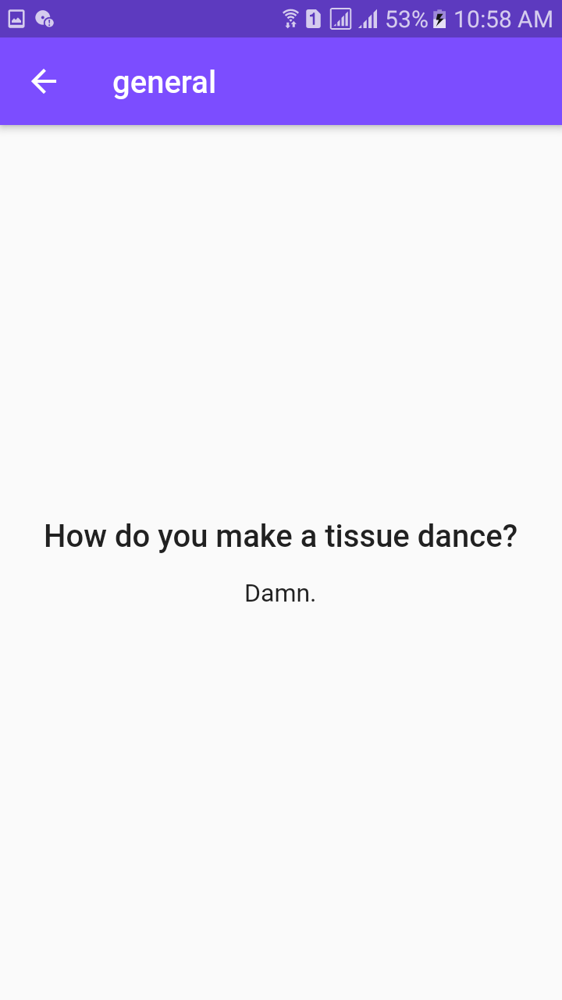
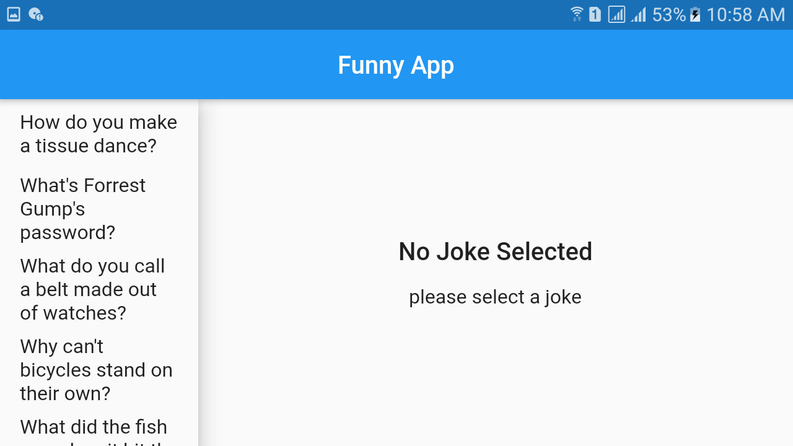
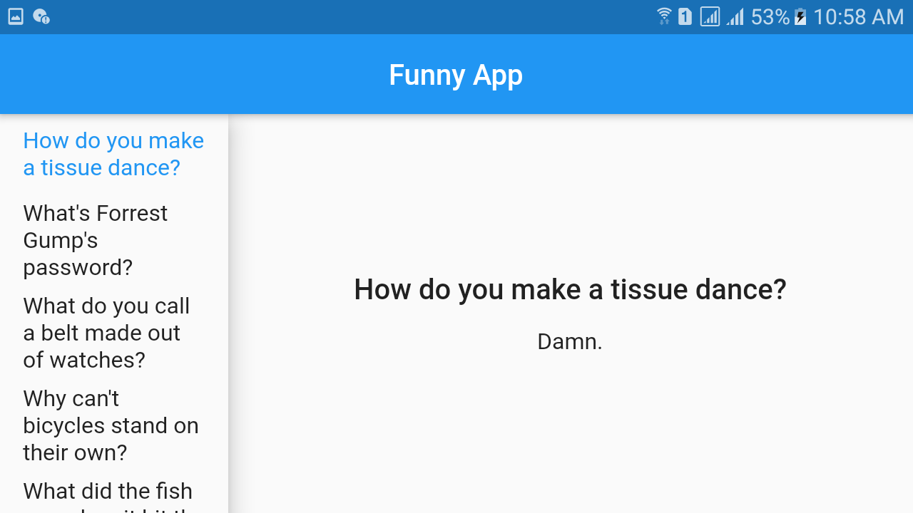

# app_screen_orientaion
## What will we learn from it
- how to manage screen (e.g moble, iphone, tablet) orientation in our app
- how to map& list use in app
- state management and lots of thing we learn from it

###############################screenShots###################

     
